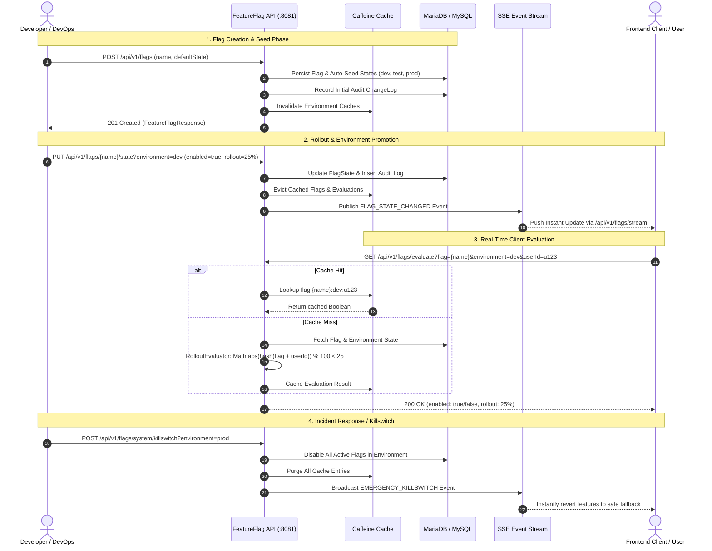
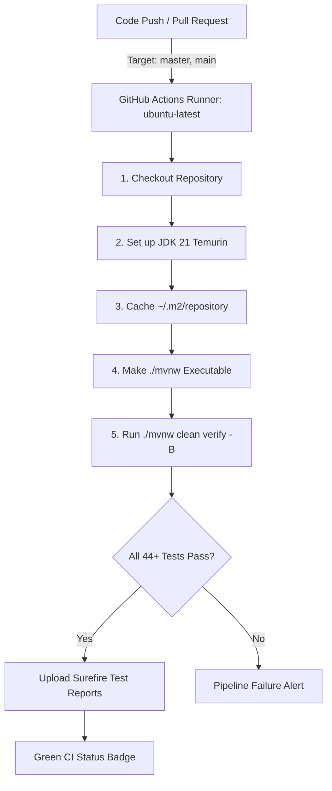

# FeatureFlagLite ⚑

[](https://github.com/SanjaiPS-tech/FeatureFlagSmasher/actions/workflows/ci.yml)


A **minimal, clean, production-style Feature Flag and Configuration Service** inspired by the core concept of [Flagsmith](https://flagsmith.com/), intentionally designed for high performance, maintainability, and clean architecture.

---

## Table of Contents

- [Project Overview](#project-overview)
- [Key Features](#key-features)
- [Architecture](#architecture)
- [Feature Flag Lifecycle & Workflow](#feature-flag-lifecycle--workflow)
- [Tech Stack](#tech-stack)
- [Database Schema](#database-schema)
- [API Documentation](#api-documentation)
- [Example Requests](#example-requests)
- [Interactive Demo Dashboard](#interactive-demo-dashboard)
- [How to Run](#how-to-run)
- [Environment Variables](#environment-variables)
- [Testing & Quality Assurance](#testing--quality-assurance)
- [CI/CD Workflow](#cicd-workflow)
- [Caching Strategy](#caching-strategy)
- [Percentage Rollout Logic](#percentage-rollout-logic)
- [Error Handling](#error-handling)
- [License](#license)

---

## Project Overview

FeatureFlagLite empowers engineering teams to:

- **Create & Manage** feature flags with human-readable keys, descriptions, and baseline defaults.
- **Environment Isolation** — Maintain independent flag configurations across `dev`, `test`, and `prod` environments.
- **Canary & Gradual Rollouts** — Enable features for 0–100% of users with deterministic hashing (a user consistently receives the same flag value).
- **Real-Time Push Updates** — Stream instant flag change events via Server-Sent Events (SSE) directly to connected frontends.
- **Auditing & Governance** — Maintain an immutable audit log detailing who modified each flag, previous states, new states, and exact timestamps.
- **Operational Safety** — One-click Emergency Killswitch to pause all active flags in an environment, plus environment synchronization tools.
- **Sub-Millisecond Evaluation** — Multi-tier caching powered by Caffeine in-memory cache.
- **Modern UI Suite** — Interactive web dashboard with real-time SSE streaming, desktop window styling, and telemetry.

---

## Key Features

| Category | Capability | Description |
|---|---|---|
| **Flag Management** | CRUD Operations | Create, inspect, modify, and delete feature flags |
| **Environments** | Multi-Environment State | Independent states per environment (`dev`, `test`, `prod`) |
| **Rollouts** | Deterministic Percentage | 0–100% rollout using Murmur-style hashing on `(flagName + userId)` |
| **Real-time** | Server-Sent Events (SSE) | Pushes instant toggle notifications to clients via `/api/v1/flags/stream` |
| **Operations** | Emergency Killswitch | Immediately disables active flags in an environment during incidents |
| **Operations** | Environment Promotion | Synchronizes and copies flag configurations between environments |
| **Governance** | Audit Log & History | Tracks changes with before/after state, author identity, and timestamps |
| **Performance** | Caffeine Cache | Sub-millisecond reads with automatic eviction upon state mutations |
| **Validation** | Bean Validation | Strict RFC 7807 structured validation errors with field-level details |
| **Reliability** | Exception Handling | Centralized `@RestControllerAdvice` mapping domain exceptions cleanly |
| **Testing** | Automated Test Suite | Comprehensive unit, repository, and controller tests with in-memory H2 |

---

## Architecture

```
Client App / Browser
       │ (REST / SSE)
       ▼
 ┌─────────────────────────────────────────────────────────┐
 │               Spring Boot 3.3.4 Web Layer               │
 │  ┌───────────────────────────┐ ┌─────────────────────┐  │
 │  │   FeatureFlagController   │ │EnvironmentController│  │
 │  └─────────────┬─────────────┘ └──────────┬──────────┘  │
 └────────────────┼──────────────────────────┼─────────────┘
                  ▼                          ▼
 ┌─────────────────────────────────────────────────────────┐
 │                      Service Layer                      │
 │  ┌───────────────────────────────────────────────────┐  │
 │  │                FeatureFlagService                 │  │
 │  │    ┌──────────────────┐    ┌─────────────────┐    │  │
 │  │    │ Caffeine Cache   │    │ RolloutEvaluator│    │  │
 │  │    └──────────────────┘    └─────────────────┘    │  │
 │  └─────────────────────┬─────────────────────────────┘  │
 └────────────────────────┼────────────────────────────────┘
                          ▼
 ┌─────────────────────────────────────────────────────────┐
 │                    Persistence Layer                    │
 │  ┌───────────────────────┐   ┌───────────────────────┐  │
 │  │ FeatureFlagRepository │   │  FlagStateRepository  │  │
 │  ├───────────────────────┤   ├───────────────────────┤  │
 │  │ EnvironmentRepository │   │  ChangeLogRepository  │  │
 │  └───────────────────────┘   └───────────────────────┘  │
 └────────────────────────┬────────────────────────────────┘
                          ▼
                  MySQL / MariaDB
```

### Package Structure

```
com.FeatureFlagLite.FeartureFlagSmasher
├── controller/     — REST controllers & SSE endpoints
├── service/        — Core business logic, cache management & event publishing
├── repository/     — Spring Data JPA repository interfaces
├── entity/         — JPA entities (FeatureFlag, FlagState, Environment, ChangeLog)
├── dto/            — Request and response Data Transfer Objects
├── exception/      — Custom exceptions & global REST exception advice
├── config/         — Cache specifications, CORS filters, and database seeds
├── mapper/         — Bidirectional entity-to-DTO mapping helpers
└── util/           — Hash-based deterministic rollout evaluation utility
```

---

## Feature Flag Lifecycle & Workflow

The following diagram illustrates the complete end-to-end lifecycle and operational workflow of a feature flag in FeatureFlagLite:



### Operational Steps in the Workflow

1. **Flag Creation**: A new flag is registered with a key and default state. The service automatically provisions associated `FlagState` records across all active environments (`dev`, `test`, `prod`) to prevent null-state divergence.
2. **Environment Configuration**: Engineers toggle flags independently per environment or set canary rollout percentages (e.g., 10% → 50% → 100%).
3. **Audit Trail Logging**: Every state or flag change creates an immutable `ChangeLog` entry recording the author, previous state, new state, and timestamp.
4. **Cache Invalidation & Real-Time Sync**: Changes automatically flush the Caffeine in-memory cache and broadcast a real-time event through Server-Sent Events (SSE) to all connected clients.
5. **Deterministic Evaluation**: Client apps evaluate flags via `/api/v1/flags/evaluate`. Using deterministic Murmur-style hashing on `(flagName + userId)`, a user always receives a consistent experience without session sticky state.

---

## Tech Stack

| Layer | Technology | Version |
|---|---|---|
| **Language** | Java (OpenJDK) | 21 (LTS) |
| **Framework** | Spring Boot | 3.3.4 |
| **Build Tool** | Apache Maven | 3.9.x (via `./mvnw`) |
| **Database** | MySQL / MariaDB (H2 for tests) | 8.x / 12.x |
| **ORM** | Spring Data JPA / Hibernate | 6.5.x |
| **Caching** | Spring Cache + Caffeine | 3.1.x |
| **Validation** | Jakarta Bean Validation | 3.0.x |
| **Realtime** | Spring Web MVC SseEmitter | 6.1.x |
| **Logging** | SLF4J + Logback | Structured |
| **Testing** | JUnit 5, Mockito, AssertJ, Spring Boot Test | 5.x / 3.3.4 |
| **Frontend** | Vanilla HTML5, CSS3, JavaScript (ES6+) | Modern SPA |

---

## Database Schema

### Entity-Relationship Diagram

```
FeatureFlag (1) ─────── (N) FlagState (N) ─────── (1) Environment
      │                           │
      │                           │
      └─── (1) ──── (N) ChangeLog (N) ──── (1) ┘
```

### Database Tables

| Table | Key Columns | Indexes & Constraints |
|---|---|---|
| `feature_flags` | `id`, `name`, `description`, `default_state`, `created_at`, `updated_at` | `name` (UNIQUE) |
| `environments` | `id`, `name` | `name` (UNIQUE: dev, test, prod) |
| `flag_states` | `id`, `feature_flag_id`, `environment_id`, `enabled`, `rollout_percentage`, `updated_at` | `(feature_flag_id, environment_id)` (UNIQUE), `0 ≤ rollout_percentage ≤ 100` |
| `change_logs` | `id`, `feature_flag_id`, `environment_id`, `old_enabled`, `new_enabled`, `old_rollout_percentage`, `new_rollout_percentage`, `changed_by`, `changed_at` | FKs to flags & environments |

---

## API Documentation

Base URL: `http://localhost:8081`

### Flag CRUD & Metadata

| Method | Endpoint | Description | Status |
|---|---|---|---|
| `POST` | `/api/v1/flags` | Create a new feature flag with default states in all environments | `201 Created` |
| `GET` | `/api/v1/flags` | Get all registered feature flags | `200 OK` |
| `GET` | `/api/v1/flags/{id}` | Retrieve feature flag by numeric ID | `200 OK` |
| `GET` | `/api/v1/flags/{flagName}` | Retrieve feature flag by its unique name | `200 OK` |
| `PUT` | `/api/v1/flags/{id}` | Update flag name and description | `200 OK` |
| `DELETE` | `/api/v1/flags/{id}` | Delete a feature flag and cascade delete states & history | `204 No Content` |

### Environment States & Evaluation

| Method | Endpoint | Description | Status |
|---|---|---|---|
| `GET` | `/api/v1/flags?environment={env}` | Get key-value map of all flag states for an environment | `200 OK` |
| `GET` | `/api/v1/flags/{flagName}/states` | Get states for a specific flag across dev, test, prod | `200 OK` |
| `PUT` | `/api/v1/flags/{flagName}/states` | Update enabled state & rollout percentage for an environment | `200 OK` |
| `GET` | `/api/v1/flags/{flagName}/evaluate?environment={env}&userId={userId}` | Evaluate whether a flag is active for a user in an environment | `200 OK` |
| `GET` | `/api/v1/flags/{flagName}/history` | Retrieve complete audit trail for a specific flag | `200 OK` |
| `GET` | `/api/v1/environments` | List all available environments (`dev`, `test`, `prod`) | `200 OK` |

### System & Operations

| Method | Endpoint | Description | Status |
|---|---|---|---|
| `GET` | `/api/v1/flags/stream` | Server-Sent Events (SSE) stream pushing live flag updates | `200 OK (text/event-stream)` |
| `GET` | `/api/v1/flags/audit` | Retrieve complete global change audit log across all flags | `200 OK` |
| `POST` | `/api/v1/flags/cache/purge` | Manually evict all Caffeine in-memory caches | `200 OK` |
| `GET` | `/api/v1/flags/system/evaluate-all?environment={env}&userId={userId}` | Bulk evaluate all registered flags for a user | `200 OK` |
| `POST` | `/api/v1/flags/system/sync?sourceEnv={src}&targetEnv={dst}` | Promote/sync all flag states from source to target environment | `200 OK` |
| `POST` | `/api/v1/flags/system/killswitch?environment={env}` | Emergency killswitch: disable all active flags in an environment | `200 OK` |

---

## Example Requests

### 1. Create a Feature Flag

```bash
curl -X POST http://localhost:8081/api/v1/flags \
  -H "Content-Type: application/json" \
  -d '{
    "name": "aiSearchRecommendation",
    "description": "Enable AI powered query auto-suggestions",
    "defaultState": false
  }'
```

### 2. Update Flag Rollout Percentage

```bash
curl -X PUT http://localhost:8081/api/v1/flags/aiSearchRecommendation/states \
  -H "Content-Type: application/json" \
  -d '{
    "environment": "dev",
    "enabled": true,
    "rolloutPercentage": 25,
    "changedBy": "lead-architect"
  }'
```

### 3. Evaluate Flag for a User

```bash
curl "http://localhost:8081/api/v1/flags/aiSearchRecommendation/evaluate?environment=dev&userId=user-42"
```

**Response (200 OK):**
```json
{
  "flagName": "aiSearchRecommendation",
  "environment": "dev",
  "enabled": true,
  "rolloutPercentage": 25
}
```

### 4. Subscribe to Real-Time SSE Stream

```bash
curl -N http://localhost:8081/api/v1/flags/stream
```

**Stream Output:**
```
event: flag_update
data: {"flagName":"aiSearchRecommendation","environment":"dev","enabled":true,"rolloutPercentage":25}
```

### 5. Trigger Emergency Killswitch

```bash
curl -X POST "http://localhost:8081/api/v1/flags/system/killswitch?environment=prod"
```

---

## Interactive Demo Dashboard

The service bundles two web interfaces served directly by Spring Boot:

- **Management Dashboard**: `http://localhost:8081/index.html`  
  View, create, toggle, and configure flags with live feedback.
- **Client Interactive Demo**: `http://localhost:8081/demo.html`  
  Split-screen simulator showing real-time client UI adaptations as flags toggle in different environments. Supports SSE live auto-sync, telemetry inspection, and persona switching.

---

## How to Run

### Prerequisites

- **Java 21 JDK** or newer
- **MySQL 8.x** or **MariaDB**
- Git

### 1. Clone the Repository

```bash
git clone https://github.com/SanjaiPS-tech/FeatureFlagSmasher.git
cd FeatureFlagSmasher
```

### 2. Set Up Database

```bash
# Login to MySQL/MariaDB
mysql -u root -p

# Create the database
CREATE DATABASE IF NOT EXISTS test_featureflaglite;
```

*(Optional: load pre-built seed data from `database/schema.sql`)*
```bash
mysql -u root -p test_featureflaglite < database/schema.sql
```

### 3. Run the Service

```bash
./mvnw clean spring-boot:run
```

The application will start on port **`8081`** by default.

---

## Environment Variables

Override default configuration in `src/main/resources/application.yml` via environment variables:

| Variable | Default Value | Description |
|---|---|---|
| `SERVER_PORT` | `8081` | HTTP web server port |
| `DB_HOST` | `localhost` | MySQL/MariaDB host address |
| `DB_PORT` | `3306` | MySQL/MariaDB port |
| `DB_NAME` | `test_featureflaglite` | Database name |
| `DB_USERNAME` | *(empty / root)* | Database credentials |
| `DB_PASSWORD` | *(empty / root)* | Database password |

---

## Testing & Quality Assurance

All unit and integration tests use an **isolated in-memory H2 database** and do not require a live MySQL instance.

```bash
# Run all tests
./mvnw test

# Run tests with complete build verification
./mvnw clean verify
```

### Test Coverage Highlights

- **44+ Automated Tests**: Covering CRUD, percentage rollout distributions, cache eviction, audit trails, and validation constraints.
- **MockMvc Web Tests**: Validating all HTTP status codes, headers, and error payload structures.
- **Distribution & Determinism Tests**: Validating consistent user bucketing and exact rollout boundaries.

---

## CI/CD Workflow

The repository includes an automated GitHub Actions continuous integration pipeline defined in [`.github/workflows/ci.yml`](.github/workflows/ci.yml).

### Pipeline Flow



### GitHub Actions Workflow Definition

Below is the complete CI workflow configuration from [`.github/workflows/ci.yml`](.github/workflows/ci.yml):

```yaml
name: CI Pipeline

on:
  push:
    branches: [ master, main ]
  pull_request:
    branches: [ master, main ]

jobs:
  build:
    name: Build & Test
    runs-on: ubuntu-latest

    steps:
      - name: Checkout repository
        uses: actions/checkout@v4

      - name: Set up JDK 21
        uses: actions/setup-java@v4
        with:
          java-version: '21'
          distribution: 'temurin'
          cache: 'maven'

      - name: Make Maven wrapper executable
        run: chmod +x ./mvnw

      - name: Compile and Run Tests
        run: ./mvnw clean verify -B

      - name: Upload Test Reports
        if: always()
        uses: actions/upload-artifact@v4
        with:
          name: surefire-test-reports
          path: target/surefire-reports/
          if-no-files-found: ignore
```

### Workflow Pipeline Stages

1. **Triggering**: Runs automatically on every `push` and `pull_request` targeting `master` or `main`.
2. **Environment**: Executes in a clean `ubuntu-latest` container with Eclipse Temurin OpenJDK 21.
3. **Dependency Caching**: Maven dependencies in `~/.m2/repository` are cached via `actions/setup-java` hashed on `pom.xml`, accelerating subsequent CI runs.
4. **Build & Test Execution**: Executes `./mvnw clean verify -B` which:
   - Validates Maven project configuration
   - Compiles all application and test sources against Java 21 bytecode release targets
   - Executes all 44+ unit, integration, and controller tests against an isolated in-memory H2 database
5. **Artifact Archival**: Generates and uploads JUnit/Surefire XML reports with `if: always()` to ensure test diagnostics are preserved even on failure.

---

## Caching Strategy

- **Provider**: [Caffeine](https://github.com/ben-manes/caffeine) in-memory cache.
- **Cached Items**:
  - Environment bulk flag lists (`flags:dev`, `flags:test`, `flags:prod`)
  - User flag evaluation results (`flagName:env:userId`)
- **Eviction**: Automatic invalidation across all cache regions whenever any flag or state is created, modified, or deleted.
- **Specs**: Maximum 500 entries, with a 600-second (10-minute) write-expiration window.

---

## Percentage Rollout Logic

```
Input:   flagName + userId
Formula: Math.abs((flagName + ":" + userId).hashCode()) % 100
Result:  bucket < rolloutPercentage ? ENABLED : DISABLED
```

- **Deterministic**: The same `userId` in the same `environment` will always resolve to the exact same bucket.
- **Uniform Distribution**: Tests confirm standard hash distribution across 0–99 buckets.
- **Canary Safe**: Gradually advancing rollout percentage from 10% → 25% → 50% guarantees existing users remain enabled.

---

## Error Handling

All error responses adhere to standard REST error formats:

```json
{
  "timestamp": "2026-09-28T14:34:16.918",
  "status": 404,
  "error": "NOT_FOUND",
  "message": "Feature flag with name 'unknownFlag' was not found"
}
```

| HTTP Status | Error Type | Scenario |
|---|---|---|
| `400 Bad Request` | `VALIDATION_ERROR` | Invalid input, blank name, rollout % not in 0–100 |
| `404 Not Found` | `NOT_FOUND` | Flag or environment does not exist |
| `409 Conflict` | `DUPLICATE_RESOURCE` | Attempting to create flag with existing name |
| `500 Server Error` | `INTERNAL_SERVER_ERROR` | Unexpected unhandled server exception |

---

## License

This project is licensed under the MIT License.
